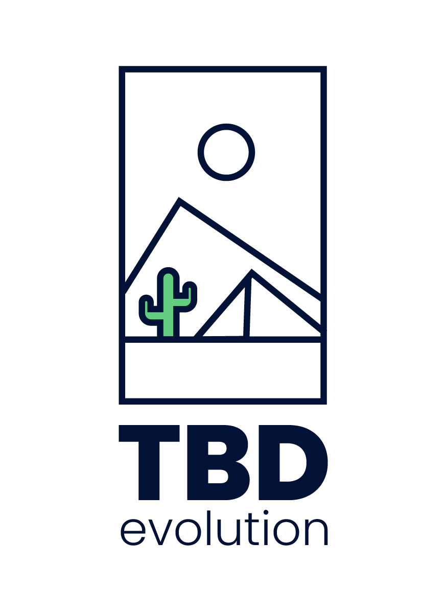

  <a href="https://tbd.flutteruki.com">
    <picture>
      
    </picture>
    <h1 align="center">TBD - The Betting Destination</h1>
  </a>

 

# Getting Started

This is a monorepo comprising TBD Client along with [npm packages](/packages) built around this.

## Documentation

Visit our [TBD-Docs site](https://tbd.flutteruki.com) to get started with TBD.

## Basic commands

For indepth step-by-step instructions visit [TBD-Docs site](https://tbd.flutteruki.com/onboarding/building-tbd)

### Setup Guides

- [Web](https://tbd.flutteruki.com/onboarding/building-tbd/web)
- [Android](https://tbd.flutteruki.com/onboarding/building-tbd/android)
- [iOS](https://tbd.flutteruki.com/onboarding/building-tbd/ios)

## Guidelines

Contributions to TBD are welcome and highly appreciated. However, before you jump right into it, we would like you to review our [contributing guide](/CONTRIBUTING.md) and our [guidelines](https://tbd.flutteruki.com/contributing/introduction) to make sure you have a smooth experience contributing to TBD.

## Troubleshooting

It is possible you may encounter some issues when getting started. Our handy [troubleshooting](https://tbd.flutteruki.com/troubleshooting/introduction) guide should help you out or feel free to ask in the [#tbd-engineers](https://flutter.enterprise.slack.com/archives/C07APFV30ES) channel for support.

## 🚦 CI Dashboard

| Projeto / Job            | Estado                                                                                                                                                 |
| ------------------------ | ------------------------------------------------------------------------------------------------------------------------------------------------------ |
| Android Visual Tests     |  |
| Android Regression Tests |          |
