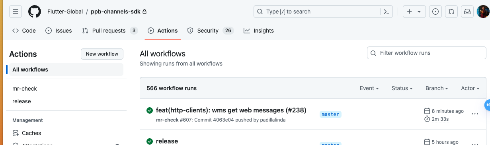
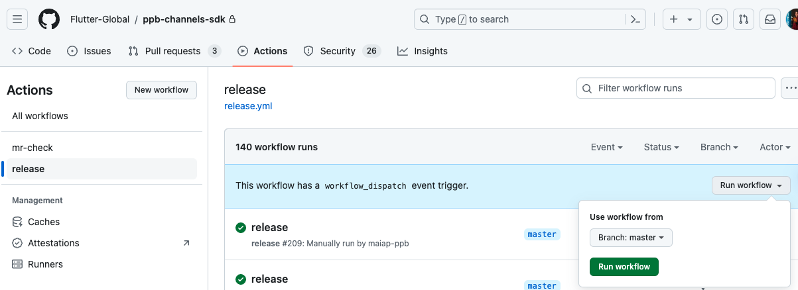
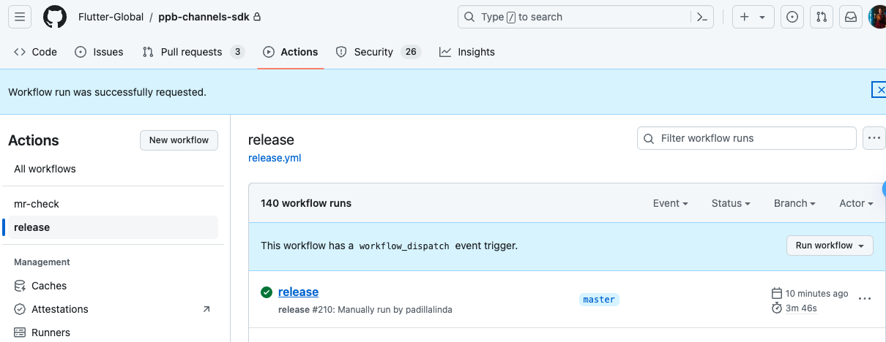
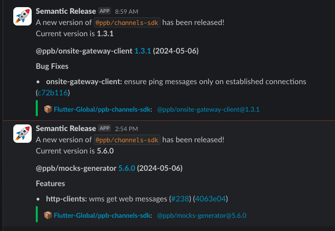
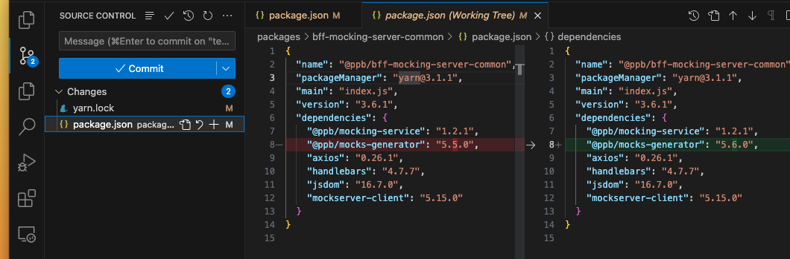

# How to Generate and Use a New @ppb/mocks-generator Version

<!-- trufflehog:ignore -->

With a new pull request in the project [@ppb/channels-sdk](https://github.com/Flutter-Global/ppb-channels-sdk), we need to generate a new version of [@ppb/mocks-generator](https://github.com/Flutter-Global/ppb-channels-sdk/tree/master/packages/http-clients). Follow these steps to generate a new version:

**1.** The pull request must have the **commit message** in the following format:

```
feat(http-clients): YOUR COMMIT MESSAGE
```

**2.** After validation and approval, **merge PR into master**.

**3.** Go to Github actions and validate that the **PR was successfully merged** without errors:

<p align="center">
 
</p>

**4.** Create a [new release manually](https://github.com/Flutter-Global/ppb-channels-sdk/actions/workflows/release.yml) in the Github actions by selecting `Run workflow` with **Branch: master**.

<p align="center">
 
</p>

If all goes well a new version will be generated and we can watch it on the **#ppb-channels-sdk** slack channel. Ex: _@ppb/mocks-generator 5.6.0 (2024-05-06)_

<p align="center">

</p>

<p align="center">

</p>
 
> [!NOTE]
> Here's a [PR](https://github.com/Flutter-Global/ppb-channels-sdk/pull/238) as an example.

**5.** With the new version of _@ppb/mocks-generator_ we can **update the version in our pull request** in the TBD-BFF project. Follow these steps:

- **5.1** Run on **_/tbd-bff/packages/bff-mocking-server-common_**:

```
$ pnpm up @ppb/mocks-generator@NEW_VERSION  (Ex: @ppb/mocks-generator@5.6.0)
```

- **5.2** Validate that the following files have been changed.

<p align="center">
 
</p>
 
> [!NOTE]
> - Here's a [PR](https://github.com/Flutter-Global/tbd-bff/pull/58) as an example.
> - The new version to _@ppb/bff-mocking-server-common_ will be generated automatically when a **TBD-BFF release is generated**. To be automatic we just need to have a commit like `feat(bff-mocking-server-common): ....` or `fix(bff-mocking-server-common): ....`

**6.** To **update the version** of _@ppb/bff-mocking-server-common_ in other strands, such as **tbd-http-webserver**, the update must be performed manually.

Run on **_/tbd_**:

```
$ yarn up @ppb/bff-mocking-server-common@NEW_VERSION`.
```

> [!NOTE]
> Here's a [PR](https://github.com/Flutter-Global/tbd/pull/3716) as an example.
