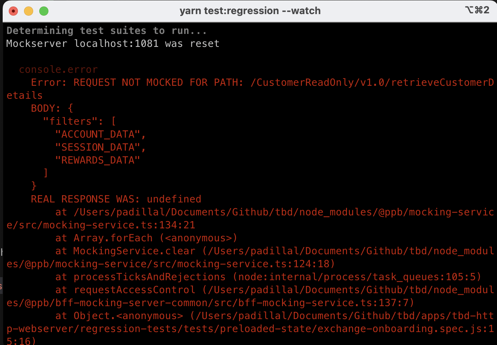
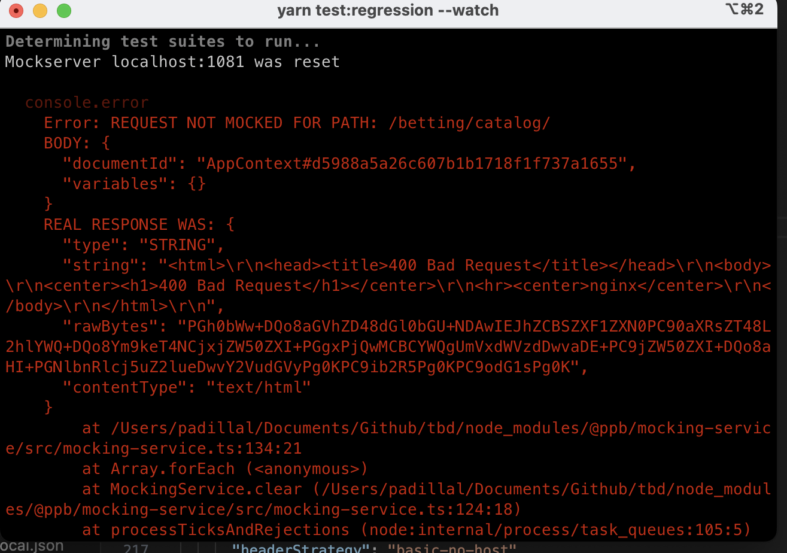
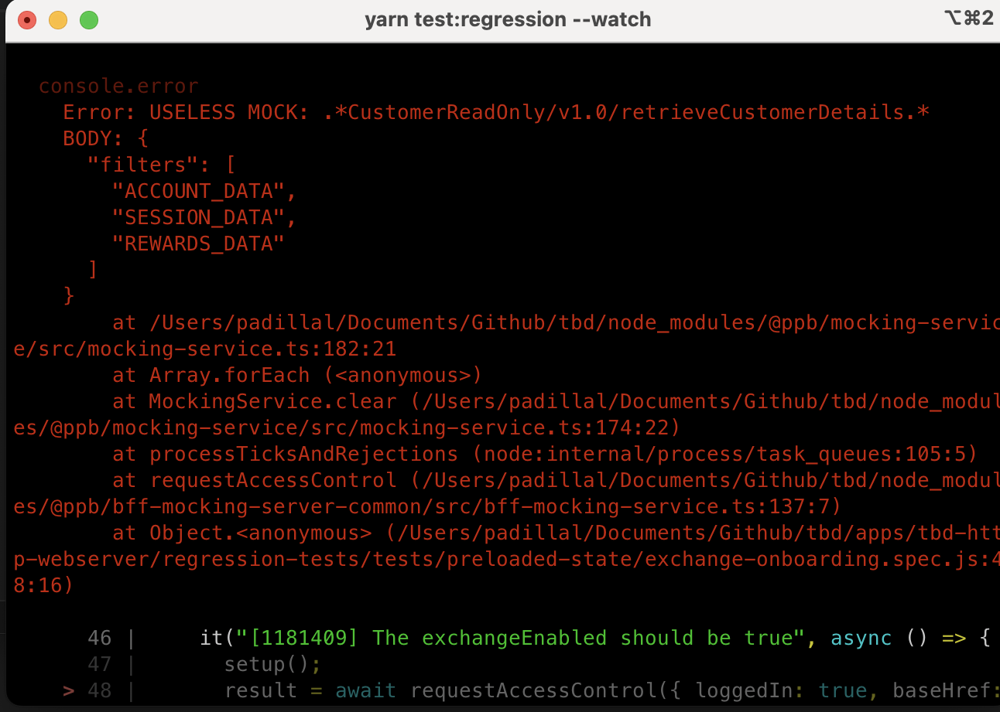

# How to Develop a Regression Test

## 1. Initial Request

Create the test in _/regression-tests/tests/preloaded-state/exchange-onboarding.spec.ts_:

```javascript
describe("Exchange Onboarding", () => {
  let result;
  let windowVariablesPO;

  describe("When a logged in user request land without exc=true param", () => {
    beforeAll(async () => {
      result = await requestAccessControl({ loggedIn: true });
      windowVariablesPO = new WindowVariablesPO(result);
    });

    it("[1181409] The exchangeEnabled should be false", async () => {
      expect(windowVariablesPO.preloadedState.boot.exchangeEnabled).toEqual(false);
    });
  });
});
```

## 2. Run the Test

Once the file is created, we can **run the test and observe some relevant information**. In the console, we can identify all the mocks required by the test, as well as view the request made to the service along with an example response:

- **2.1** . For our example we will need to define a **mock to get a user data**.

<p align="center">

</p>

- **2.2** In the next image we have another mock that we have to create in order for _TBD-BFF_ to get the **app context data**.

<p align="center">
 
</p>

- **2.3** Also, when we have **unused mocks** the console also specifies this information. For example in the next image we can see that we do not need to define login data mock if the test scenario is for a case without login.

<p align="center">
 
</p>

## 3. Mock Request Response

After identifying the missing mocks we start to create them and **define the structure of our service responses**. For the _TBD-BFF_ case, let's define the app context response and for _CRO_ service user data.

```javascript
const APP_CONTEXT = {
  userdetails: {
    jurisdiction: {
      jurisdiction: "international",
    },
    productExclusions: [],
  },
  experiments: [],
  preferences: {
    confirmCashout: { urn: "urn:confirmCashout", shouldConfirmCashout: false },
    exchangeConfirmBetPlacement: { urn: "urn:exchangeConfirmBetPlacement", shouldConfirmBetPlacement: false },
    oddsMovement: { urn: "urn:oddsMovement", shouldAcceptOddsMovement: false },
    showBalances: { urn: "urn:showBalances", shouldShowBalances: false },
    quickStakes: { urn: "urn:quickStakes", selectedQuickStakes: [] },
    exchangeOddsDisplay: { urn: "urn:exchangeOddsDisplay", selectedOddsDisplayFormat: "FRACTIONAL" },
    sportsbookOddsDisplay: { urn: "urn:sportsbookOddsDisplay", selectedOddsDisplayFormat: "FRACTIONAL" },
    favoriteSports: { urn: "urn:favoriteSports", selectedFavoriteSports: [] },
    defaultProduct: { urn: "urn:defaultProduct", selectedDefaultProduct: "exchange" },
    exchangeDefaultProduct: { urn: "urn:exchangeDefaultProduct", selectedExchangeDefaultProduct: null },
    products: { urn: "urn:products", selectedProduct: null },
    lastViewedProduct: { urn: "urn:lastViewedProduct", selectedLastViewedProduct: "sportsbook" },
  },
  throttles: [],
  brandSettings: [],
  pollcadences: null,
  registration: [],
};

const USER_DATA = { accountID: 123, username: "Test 1" };
```

In case we need to create **new mocks templates** we need to create a pull request in the project **Github - ppb-channels-sdk** and associate the branch with our local branch in the TBD project.

To create a mock template, we must follow the next steps:

- **3.1** Go to **/tbd/apps/tbd-http-webserver/package.json** and use a symlink in the _@ppb/bff-mocking-server-common_:

```javascript
"@ppb/bff-mocking-server-common": "link:/WORKSPACE_DIR/tbd-bff/packages/bff-mocking-server-common",
```

- **3.2** Clone [tbd-bff](https://github.com/Flutter-Global/tbd-bff) project and do the setup. Then go to **tbd-bff/packages/bff-mock-server-common** and follow only the step 1 defined in [README.md](https://github.com/Flutter-Global/tbd-bff/blob/master/packages/bff-mocking-server-common/README.md).

- **3.3** Clone [ppb-channels-sdk](https://github.com/Flutter-Global/ppb-channels-sdk) project and do the setup. Then go to **/ppb-channels-sdk/packages/http-clients** and execute `npm run build`

- **3.4** Go to **/tbd-bff/packages/bff-mock-server-common** and execute `pnpm build`

- **3.5** Go to **/tbd** and execute `yarn install`

- **3.6** In **/tbd/apps/tbd-http-webserver** run `yarn fabric:regression` and `yarn test:regression --watch`

- **3.7** Create a new template or update some template and run `npm run build` again in **/ppb-channels-sdk/packages/http-clients**

- **3.8** Execute again only the test `yarn test:regression --watch`

> [!NOTE]
>
> - `yarn start:regression` script is unable to create/change mock templates.
> - The mock templates will be migrated to `TypeScript` at a later stage. If new services are created, ask in the **#ask_bff** channel for examples of how to create mocks in typescript.

## 4. Set Up the Mocks

With our mock templates created in the _beforeAll_ hook, we proceed to set up the mocks.

```javascript
describe("Exchange Onboarding", () => {
  let result;

  describe(`When a logged in user request land without exc=true param`, () => {
    beforeAll(async () => {
      mockRequest(getUserData({ accountID: 123 }));

      mockRequest(
        getAppContext({
          userdetails: {
            jurisdiction: {
              jurisdiction: "international",
            },
            productExclusions: [],
          },
          experiments: [],
          preferences: buildPreferencesMock(),
          throttles: [],
          brandSettings: [],
          pollcadences: null,
          registration: [],
        }),
      );

      result = await requestAccessControl({ loggedIn: true });
    });
  });
});
```

## 5. Create the Expectations

```javascript
describe("Exchange Onboarding", () => {
  let result;
  let windowVariablesPO;

  describe(`When a logged in user request land without exc=true param`, () => {
    beforeAll(async () => {
      mockRequest(getUserData({ accountID: 123 }));

      mockRequest(
        getAppContext({
          userdetails: {
            jurisdiction: {
              jurisdiction: "international",
            },
            productExclusions: [],
          },
          experiments: [],
          preferences: buildPreferencesMock(),
          throttles: [],
          brandSettings: [],
          pollcadences: null,
          registration: [],
        }),
      );

      result = await requestAccessControl({ loggedIn: true });
      windowVariablesPO = new WindowVariablesPO(result);
    });

    it("[1181409] The exchangeEnabled should be false", () => {
      expect(windowVariablesPO.preloadedState.boot.exchangeEnabled).toEqual(false);
    });
  });
});
```
