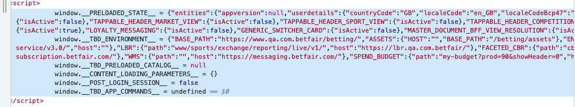
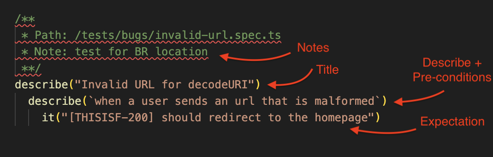

# Guidelines for Defining Test Cases

## 1. Structure

Tests are organized based on their purpose or on the location of the attribute being validated.

If the goal is to test a property within the _preloaded_state_ variable we define the test case within the group **"Preloaded State"**. For example: If we want to test the _Exchange Onboarding_ property we created the test within the Preloaded State group.

## 2. Test Case

Once we know where to create the test, we can create a file and attach it to the user story as defined in the following image:

- **1. Title (Test Case name)** - _optional but recommended_: purpose of the test or the attribute under validation.

- **2. Notes** - _optional but recommended_: small notes about what we are testing in the Test Case.

- **3. Pre-conditions** - _mandatory_: Necessary parameters, conditions or actions for test can run. This information is included in the **describes**.

e.g.: _For the request if the client is loggedIn or loggedOut. Also the location information that the test case must consider_

- **4. Describes** - _mandatory_: Must be composed of "When web client request" + "pre-conditions/actions".

e.g.: _"When a user sends an url that is malformed"_

- **5. Expectations** - _mandatory_: Must be composed of "it should be" + "expectation".

e.g.: _"it should redirect to the homepage"_

> [!NOTE]
> If a new US/Bug requires changing an expectation, the **previous id should also be changed to match the new US/Bug** that motivated that change. The goal here is to allow us to always find the updated corresponding US/Bug in order to validate any Acceptance Criteria or other valuable information required when performing new tests.
