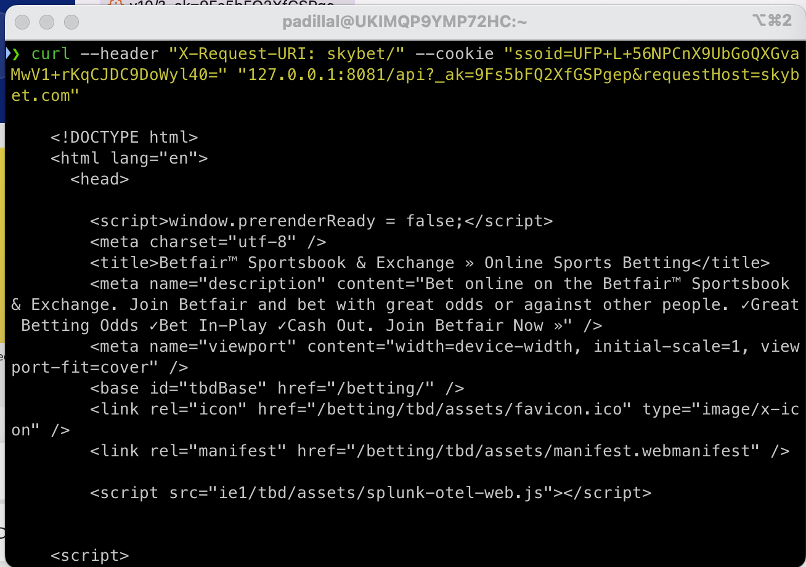
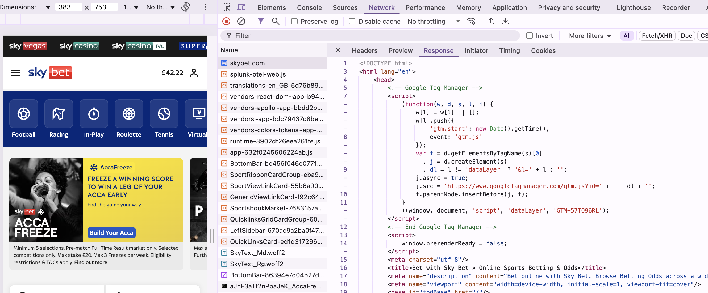

# How to Test Manually

In order to test the TBD-HTTP-WEBSERVER, ensure the strand is running locally by following the instructions:

## 1. Run only TBD-HTTP-WEBSERVER strand

At the root directory, generate the config-files:

```
$ yarn install
$ yarn generate-config-files
```

To run the strand, switch to **_/apps/tbd-http-webserver_** and run:

```
$ yarn docker:build
$ yarn docker:run:bf
```

> [!NOTE]
> We can choose the brand when executing the strand. For Skybet, the script is `docker:run:sbg`

On the same path **_/apps/tbd-http-webserver_** in another terminal window:

```bash
curl --header "X-Request-URI: betting/" --cookie "ssoid=Y33VeNIWMEsDZqhd32rYLHtLHlc9koVACT3HkbzL/s4=" "127.0.0.1:8081/api?_ak=Q5vPQGFHSYfsasIo&requestHost=betfair.com"
```

or if we run `docker:run:sbg`

```bash
curl --header "X-Request-URI: skybet/" --cookie "ssoid=Y33VeNIWMEsDZqhd32rYLHtLHlc9koVACT3HkbzL/s4=" "127.0.0.1:8081/api?_ak=9Fs5bFQ2XfGSPgep&requestHost=skybet.com"
```

As a result, we obtain the HTML with the information, as we can see in the image:

<p align="center">

</p>

> [!NOTE]
> If we have problems with the BFF catalog, see the **Troubleshooting** section in [README.md](../../regression-tests) file.

## 2. Run Web Application

Another alternative is to run the web application locally and view the result in the browser console. See more details [here](https://tbd.flutteruki.com/onboarding/building-tbd).

<p align="center">

</p>

Or with Flexible Environment and check the result in the browser console.
