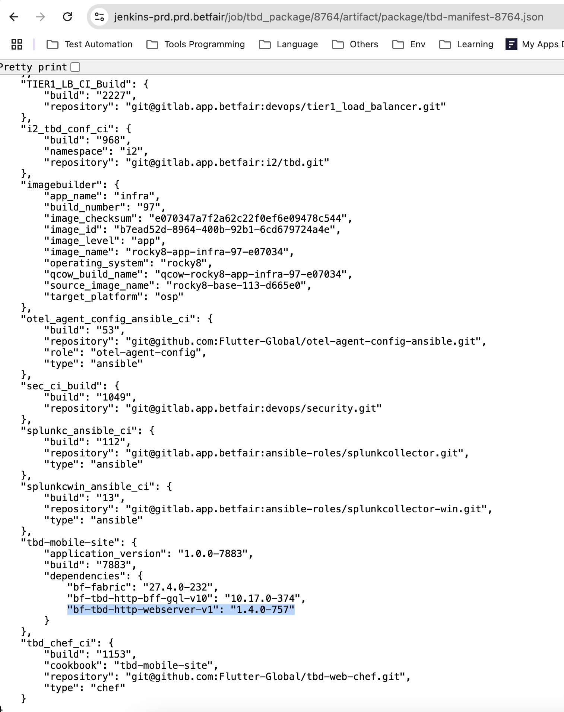

# Essential Checks for a Version Release

In this section, we’ll find a checklist to follow when a new TBD-HTTP-WEBSERVER version becomes available:

1. **Version Details**: The specifics of the version are available in the [tbd_http_webserver_ci_build](https://jenkins-prd.prd.betfair/job/tbd_http_webserver_ci_build/) jenkins job.

2. **Version Update**: The client version must be bumped and verified in the manifest file or in the release scope documentation.

> [!NOTE]
> The _1.4.0-757_ value is composed by the TBD-HTTP-WEBSERVER version defined in the **tbd/apps/tbd-http-webserver/tbd-http-webserver.spec** file more the build number defined in the **tbd_http_webserver_ci_build** jenkins job.

3. **Testing**: After the new version is bumped in the web application, we can test the changes when the version is made available in the environment.
