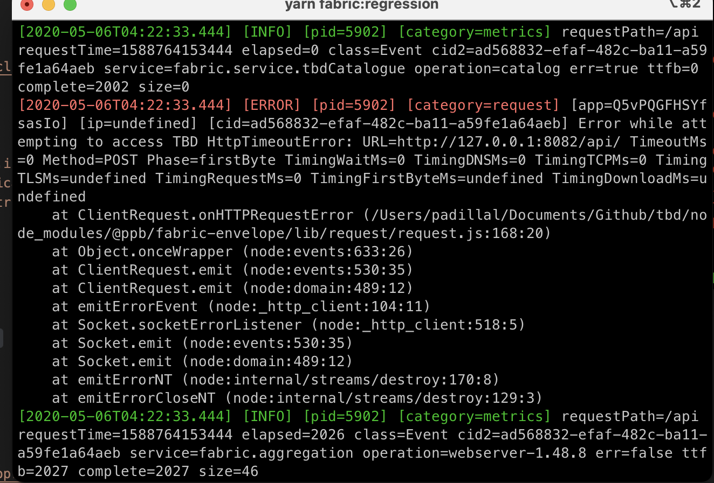

# Regression Tests

Our regression tests focus on the strand that returns the HTML used to start the web app with some initial data. The idea is to make sure that whenever the code changes, the HTML and the embedded data stay consistent. We organize tests by purpose or by the attribute being checked, so it’s easy to see what each test is protecting against and quickly catch any unexpected regressions.

## Run Regression Tests

Start the Mock Server on port 1081, start the strand pointing to Mock Server endpoints.

```
$ pnpm run start:regression
```

Run the regression tests pointing to the local container. Don't forget you can run them with the `--watch` flag.

```
$ pnpm run test:regression
```

## Step-by-Step Guide to Creating a Regression Test

1. [Guidelines for Defining Test Cases](../docs/tests/test-case-guidelines.md): Define where the test should reside within the codebase with the best practices outlined above to design a clear, focused, and maintainable test case.
2. [How to Run Regression Tests](../docs/tests/run.md): Provide detailed instructions on how to execute regression tests locally.
3. [How to Develop a Regression Test](../docs/tests/setup.md): Include an example that demonstrates how changes to service mocks affect the test in real time.
4. [How to Create and Use a New @ppb/mocks-generator Version](../docs/tests/create-mocks-generator.md): Step-by-step guide on how to create and integrate the new mock version into your tests.

## Best Practices for Creating Regression Tests

### When defining a regression test:

- [x] **Define a clear objective**: Ensure each test is purpose-driven.
- [x] **Choose the appropriate test group**: Identify where in the structure the test belongs.
- [x] **Document in the User Story (US)** the test cases: Indicate the test's goal and its proper placement.
- [x] **Coordinate with developers**: Share the test plan to avoid duplication with unit tests and improve coverage.

### When implementing a regression test:

- [x] Ensure the test is **readable and self-explanatory**, and clearly validates the expected conditions.
- [x] Create **realistic scenarios** that reflect actual client requests.
- [x] If applicable, add **edge/exception scenarios** that could break the flow.
- [x] Reference the **User Story ID in assertions**, allowing traceability back to the original development.

## Troubleshooting

1. When we have httpTimeoutError in the console, as we can see in the image:

<p align="center">

</p>

We have to correct the bff catalog endpoint to **"https://apitbd.qa.com.betfair/betting/catalog"**:

```javascript
"CustomRestClients": {
      "tbdCatalogue": {
        "keepAliveTimeoutMs": 120000,
        "url": "https://apitbd.qa.com.betfair/betting/catalog",
        "poolSize": 20,
        "timeout": 2000,
        "headerStrategy": "basic"
      }
    },
```

- To **Docker** script change the _url_ property in file _/tbd/apps/tbd-http-webserver/config/webserver-config-http-bf-qa.json_

- To **Fabric** script change the _url_ property in file _/tbd/apps/tbd-http-webserver/config/webserver-config-http-bf-qa-local.json_

2. If `docker-compose version` is not recognised, run the command:

```bash
sudo ln -s /usr/bin/docker /usr/local/bin/docker-compose
```

## Inductions

Also, for a general overview there is a [recorded induction session](https://flutteruki.zoom.us/rec/component-page?action=viewdetailpage&sharelevel=meeting&useWhichPasswd=meeting&clusterId=aw1&componentName=need-password&meetingId=2O0z9JkSdY3sMWXTI4Q1DZxX765f1yo0fVMyiK4e5HGnv5znicoEgbS0PBMn6iax.TcXQRp2uq1im3F6L&originRequestUrl=https%3A%2F%2Fflutteruki.zoom.us%2Frec%2Fshare%2F39AHXWXaS6gIk1Q-SH3RwbVwN89foP37sJ1OT-Vx6mOiE2NsABXlCIKuJZB2qNNn.StmWt2pxxWsbr-_2). The password is WAzb^1y1.
