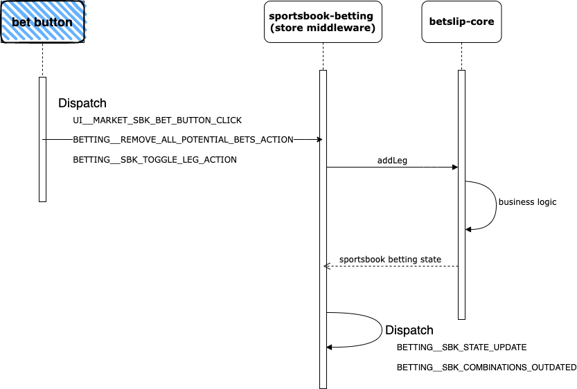
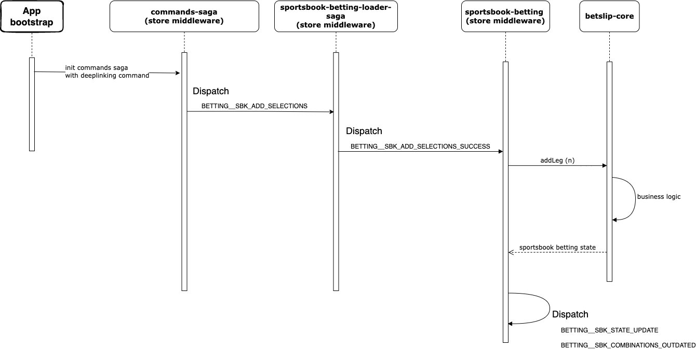
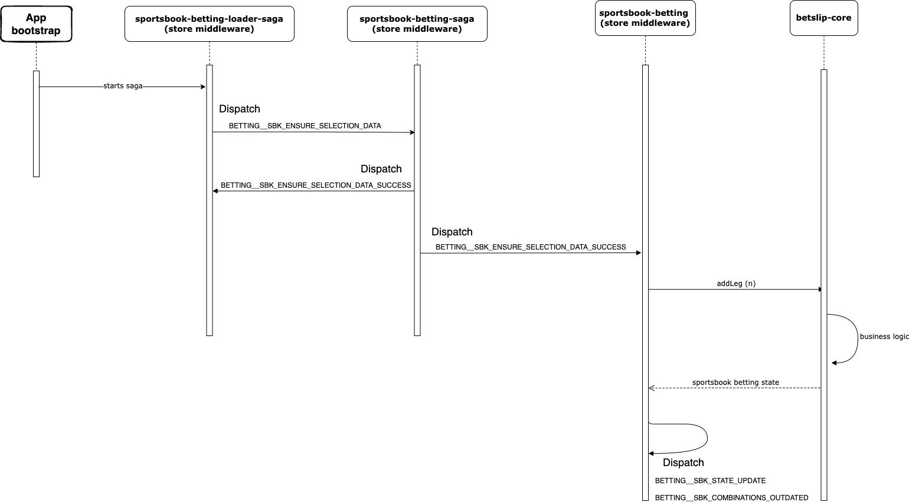

# Sportsbook Betslip

This document only refers to betslip handling of sportsbook bets.

All betting logic is depending of a chunk, betslip.js. It's loaded asynchronously after the app
is ready. Therefore, we need to be aware that it's not immediately available. We rely on the
dispatch of `MODULES__SBK_BETTING_LOADED`. Only after this is triggered, all betslip features
are enabled. This is true for both verticals, exchange and sportsbook.

A really high level view of the betslip functionality is: some redux actions, prefixed with
`BETTING`, are dispatched, handled on middleware to call some function of _@ppb/betslip-core_
that returns the new state for betting and then request SIB for a new update.

Let's talk about the features that make those redux actions get triggered.

## Features

There are several ways to add selections to the betslip. Most important being the
bet buttons, deeplinks and persistency (ok, this last one is more like rebuilding the betslip).
There are others, like re-use selections or popular bet builder, but they use a similar flow as
the bet button.

All of them start by an redux action being triggered, that goes through a redux middleware named
[sportsbook-betting.ts][betting]. Probably the most important file for the betslip. The
middleware handles some app specific logic and then delegates to _@ppb/betslip-core_. Which in
turn returns a new state.
Anytime a state change happens with a function of _@ppb/betslip-core_ this is reported as a
`BETTING__SBK_STATE_UPDATE` for it to be included in the store.
Certain betting actions require us to imply new bet combinations based on the existing
selections, this is requested with `BETTING__SBK_COMBINATIONS_OUTDATED`, which ends up calling
`updateCombinations` from _@ppb/betslip-core_.

### Bet button

A [bet button click event][sbk-bet-button] triggers 3 different redux actions.

- UI\_\_MARKET_SBK_BET_BUTTON_CLICK: used mostly for analytics purposes
- BETTING\_\_REMOVE_ALL_POTENTIAL_BETS_ACTION: clears exchange betting state
- BETTING\_\_SBK_TOGGLE_LEG_ACTION: adds/removes leg to Betslip

`BETTING__SBK_TOGGLE_LEG_ACTION` is intercepted on sportsbook-betting middleware and handles
the adding of a selection to betslip (it would also handle removing a selection from betslip,
on this example the betslip was empty). It interacts with _@ppb/betslip-core_, updates the betting
state accordingly and notifies that combinations are outdated.

This flow can be seen here:

### Deeplinking

Betslip can handle different patterns of deeplinks. These patterns came from classic Betfair,
SMX and SBW. You can add more patterns by creating an adapter on [deep linking resolver][deep-linking-resolver].

Examples of currently supported deeplinks:

- https://www.betfair.com/betting/?bets=SIMPLE_SELECTION:924.282663837%7C48461
- https://www.betfair.com/betting/?bets=924.282663837%7C48461
- https://www.betfair.com/betting/?modules=betslip&action=addAffiliateSelections&bssId=150463,&bsmId=924.261570861

Deeplinks are translated to an app command called `CMD/LOAD_SBK_BETSLIP`. This command is
injected on the web app by http-webserver strand. For native app, it's handled on the
client side (native app).

When the app boots, it starts a middleware called `commands-saga` that will handle the
mentioned command, dispatching a redux action to add all needed selections to betslip.

#### Side note

When the app uses a deeplink, all betslip persisted state is ignored. Deeplinking takes
precedence over persistence feature. It's a product requirement that needs to be
taken in account on future developments.

This flow can be seen here:

If you want to know more about this feature see [the Web Deeplinking Analysis document][deep-linking-analysis].

### Persistency

Betslip persists its state using local storage.

When the app bootstraps it instantiates a redux saga called `sportsbook-betting-loader-saga`.
Its job is to check the local storage for saved state. If there is a
valid state, it tries to populate betslip with it. What if it's invalid? The
sportsbook-betting entry on local storage gets removed.

Imagine this. The user adds two selections from football page and leaves the app. When coming back opens
the app on the home page. The football selections may not be present in the store, depending
on the content we have at the moment. If that happens, we need to fetch the selections.

It does so by calling a `BETTING__SBK_ENSURE_SELECTION_DATA` action. This will check if all required
data to populate betslip is available, and if not, fetch the data and **ensure** it's available.

After we have all the needed data available, we update the sportsbook betting state and open betslip.

This flow can be seen here:

## Betslip core

[_@ppb/betslip-core_][betslip-core-repo] is a agnostic package — unaware of brand, framework or
jurisdiction — which solely deals with business logic.

All betting business interactions, calculations, validations, failures are given out by this
package. Since the module is used by other projects in the company, it must be kept agnostic.

Projects using this package:

- Rebuild Mobile
- PaddyPower Mobile
- PaddyPower Desktop
- PaddyPower Dial-A-Bet

It functions similarly to a reducer. Picks up a state, changes it and returns a new one.

Some examples of what _@ppb/betslip-core_ does:

- Calculate potential returns & total potential returns
- Calculate total stakes
- Verify thresholds of max / min stakes and others
- Manage free bets & other offers such as price boost
- Manage all possible combination of bets
- Report failures in bet placement
- Report failures when implying bets

Usually it's a stable package. It doesn't change much. Unless a new/missing betting
feature is required.

Check [Sportsbook Betting SDK guide][sbk-betting-sdk] for more detailed information on the package.

## Imply Bets

One key service for betslip is [Sportsbook Imply Bets (SIB) service][sib]. This service provides
data on how to display selections or other information on betslip. Such as the combinations available,
which feature they belong to (bet builder for example), combination limits (minimum/maximum stake or
the max payout), etc.

For every selection added/removed, or even suspended, betslip requests SIB to know
which combinations are available.

For example:

1. user adds a selection from game A, SIB replies with one single
2. user adds a second selection from game B, SIB replies with two singles and
   one multiple
3. user adds a third selection from game A, SIB replies with three singles, one multiple, one bet
   builder and one multi bet builder

If you see an error displaying on the betslip before attempting to place the bet, check SIB
response for details.

SIB takes jurisdiction into context, which means the response for the same selections may
vary if it's being requested on different jurisdictions.

Check out [sportsbook-betting-combinator-saga.ts][combinator-saga] to look into the details on how
the app interacts with SIB.

## Placing the bet

A bet placement can be triggered by simply dispatching a `BETTING__SBK_PLACE_BETS` action without
any payload. This is true because the middleware responsible for placing the bet,
[sportsbook-betting-transactional-saga.ts][transactional-saga], uses the current store state to decide
what bet should be placed.

This middleware makes a network request to [Sportsbook Place Bet (SPB)][spb] service using the
`fixedOddsTransactionalClient`, and, if successful, stores a snapshot of the placement result
that's used to display the receipt.
If it fails, a `NETWORK__PLACE_SBK_BET_FAILURE` action is dispatched with the error thrown by SPB
service, that will be used to display an error notification to the user.

There are some details in this flow that you should be aware of:

- before placing the bet, we read the current odds movement preference and we add that info to the
  service request.
- after a successful bet placement, we store metadata related to runners besides the service response,
  in order to properly show the receipt.

## Virtual sports

The most common betting is usually on real sports, but there’s also virtual sports.

This is an important distinction to know. They’re very similar, but use a different
service, [Sportsbook Event Readonly (SER)][ser], for markets data and have different entities
on the store. For example, regarding markets, we have SportsbookMarket for real sports
and VirtualMarket for virtual sports.

They’re distinguished on code with the BettingGroup enum composed of BettingGroup.Real
and BettingGroup.Virtual. _@ppb/betslip-core_ needs this distinction to know in which
group it should operate on (it is possible to have both “betslips” at once, this
isn’t a feature used by rebuild).

Once one or more selections are added to betslip, it uses the same services for
displaying the betslip and its combinations/errors, SIB, and to place the bet, SPB.

## Other jurisdictions

### Italy

For the italian jurisdiction, betslip displays the combinations list that are made for
multiples with more than one line (think of Doubles for example). The combinations
component is used on [MultiplesCard][multiples-card].

To get the combinations, it uses [Bet Combination Engine (BCE)][bce].

## Throttles

| Name                         | Description                              |
| ---------------------------- | ---------------------------------------- |
| MULTI_BET_BUILDER_ONBOARDING | show/hide the onboarding message for MBB |

## Experiments

| Name                           | Description                                   |
| ------------------------------ | --------------------------------------------- |
| exp-bf-sports-betslip-sections | controls which sections are opened by default |

## Important files

### Connected components

- [RootBetslip][root-betslip]
- [SportsbookBetslip][sbk-betslip]
- [SportsbookPlace][sbk-place]
- [SportsbookReceipt][sbk-receipt]

### Middlewares

- [sportsbook-betting-combinations-list-saga.ts][combinations-saga]
- [sportsbook-betting-combinator-saga.ts][combinator-saga]
- [sportsbook-betting-commands-saga.ts][commands-saga]
- [sportsbook-betting-loader-saga.ts][loader-saga]
- [sportsbook-betting.ts][betting]
- [sportsbook-betting-saga.ts][betting-saga] (we should rename this one)
- [sportsbook-betting-transactional-saga.ts][transactional-saga]

[sbk-bet-button]: ../../packages/tbd-shared/components/SportsbookBetButton/map-to-props-factory.ts
[root-betslip]: ../../packages/tbd-shared/components/Betslip/RootBetslip/RootBetslip.web.tsx
[sbk-betslip]: ../../packages/tbd-shared/components/Betslip/SportsbookBetslip/SportsbookBetslip.web.tsx
[sbk-place]: ../../packages/tbd-shared/components/Betslip/SportsbookPlace/SportsbookPlace.web.tsx
[sbk-receipt]: ../../packages/tbd-shared/components/Betslip/SportsbookReceipt/SportsbookReceipt.web.tsx
[multiples-card]: ../../packages/tbd-shared/components/Betslip/MultiplesCard/
[combinations-saga]: ../../packages/tbd-store/middlewares/sportsbook-betting-combinations-list-saga.ts
[combinator-saga]: ../../packages/tbd-store/middlewares/sportsbook-betting-combinator-saga.ts
[betting-commands-saga]: ../../packages/tbd-store/middlewares/sportsbook-betting-commands-saga.ts
[commands-saga]: ../../packages/tbd-store/middlewares/commands-saga.ts
[loader-saga]: ../../packages/tbd-store/middlewares/sportsbook-betting-loader-saga.ts
[betting-saga]: ../../packages/tbd-store/middlewares/sportsbook-betting-saga.ts
[betting]: ../../packages/tbd-store/middlewares/sportsbook-betting.ts
[transactional-saga]: ../../packages/tbd-store/middlewares/sportsbook-betting-transactional-saga.ts
[deep-linking-resolver]: ../../packages/tbd-store/modules/deep-linking-resolver.ts
[deep-linking-analysis]: https://flutteruki.atlassian.net/wiki/spaces/BSBG/pages/145427515/BFRB+Feature+Analysis+-+Web+Deeplinking+Analysis+-+Web+Deeplinking#Deck--313081318
[sbk-betting-sdk]: https://flutteruki.atlassian.net/wiki/spaces/betfairsports/pages/175192383/Sportsbook+Betting+SDK
[bce]: https://flutteruki.atlassian.net/wiki/spaces/FP/pages/81678657/BCE+-+Bet+Combination+Engine
[sib]: https://flutteruki.atlassian.net/wiki/spaces/SportsbookPlatform/pages/97282934/SIB+-+Imply+Bets+Service
[spb]: https://flutteruki.atlassian.net/wiki/spaces/SportsbookPlatform/pages/97285967/SPB+-+Place+Bets+Service
[ser]: https://flutteruki.atlassian.net/wiki/spaces/SportsbookPlatform/pages/97462667/SER+-+Sportsbook+Event+ReadOnly
[betslip-core-repo]: https://gitlab.app.betfair/exchange-components/betslip-core
