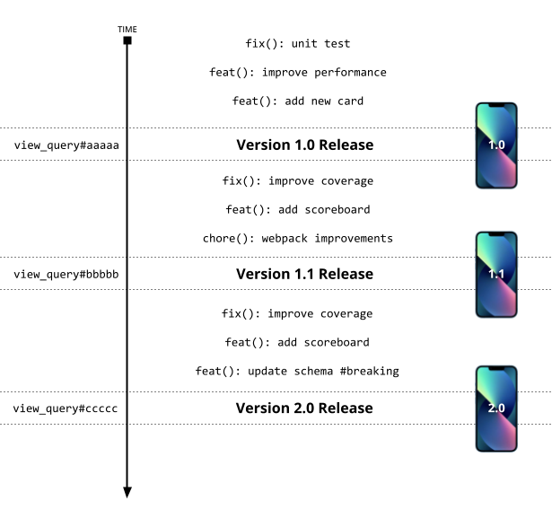
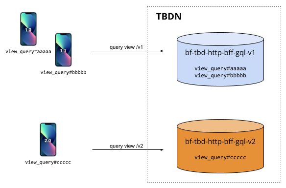

# BFF Versioning

## Problem

The following image tries to exemplify the development and release of our native applications. Everytime someone changes [schema.graphql](../apps/bf-tbd-http-bff-gql/src/schema.graphql), our queries changes and therefore the query hash changes (e.g. #aaaaa => #bbbbb).



Considering that we are supporting the last 3 released versions of our apps, we need to make sure that our environments support all 3 versions.

Using the previous image as reference, our environments should have support for the following queries:

- `view_query#aaaaa # Version 1`
- `view_query#bbbbb # Version 1.1`
- `view_query#ccccc # Version 2.0 Breaking!`

Since the last query requires breaking changes on BFF, we can't maintain support for all 3 queries with a single instance of BFF.

## Solution

In order to maintain native apps running in production even after BFF releases breaking changes, we need to maintain multiple BFF versions running at once in all environments.



The current versions and their respective builds can be found on [tbd-native.spec](../tbd-native.spec):

```
Provides: tbd-native
Requires: bf-fabric = 19.0.0-594
Requires: bf-tbd-http-bff-gql-v1 = 1.0.0-1725 # BFF Version 1
Requires: bf-tbd-http-bff-gql-v2 = 2.0.0-1748 # BFF Version 2
```

In order for this to work, there are several step that need to be followed:

## Step 1 - Bump BFF package.json with a major version

Some of the next steps require [package.json](../apps/bf-tbd-http-bff-gql/package.json) to be updated so we can extract correctly which major version are we dealing with (e.g. v1/, v2/, v3/).

**Example**: bumping a major version from 11.0.9

```
{
  "name": "@ppb/bf-tbd-http-bff-gql",
  "version": "12.0.0",
}
```

## Step 2 - Generate a new extracted_queries file

The usual `compile-graphql` command will now generate a new extracted queries with the current BFF version

```
> yarn compile-graphql
>
> packages/tbd-store/clients/catalogue/extracted_queries_v12.json 84ms
```

## Step 3 - Add the RPM to spec files

After having a successful BFF build we should add the new RPM version to the respective spec files: [tbd-native.spec](../tbd-native.spec) and [tbd-mobile-site.spec](../tbd-mobile-site.spec)

At the time of the writing of this document, Native uses multiple versions of BFF and Web only uses the latest.

```
Requires: bf-tbd-http-bff-gql-v10 = 1.0.0-1725 # BFF Version 10
Requires: bf-tbd-http-bff-gql-v11 = 2.0.0-1748 # BFF Version 11
Requires: bf-tbd-http-bff-gql-v12 = 2.0.0-1748 # BFF Version 12, the latest
```

## Step 4 - Update the strand configuration after this new deploy

Releasing a new BFF version may also means that an older one is deprecated. Updating this requires chef-cookbook changes:

**Cookbooks:**

- Native: https://gitlab.app.betfair/chef-cookbooks/tbd-native/-/blob/master/attributes/strands-config.rb
- Web: https://gitlab.app.betfair/chef-cookbooks/tbd-mobile-site/-/blob/master/attributes/strands-config.rb

```
{
    'ports' => [8100, 8101, 8102, 8103, 8104],
    'name' => 'bff-gql',
    'version' => 'v12',
    'tla' => 'tbd',
    'type' => 'http',
    'ssi' => false,
    'upstreamkeepalive' => 32,
    'pm2' => {
        'node_args' => '--abort_on_uncaught_exception --nouse_idle_notification --max_old_space_size=384',
        'max_memory_restart' => '576M',
        'env' => {
        'NODE_ENV' => node['fabric']['NODE_ENV'],
        'UV_THREADPOOL_SIZE' => node['fabric']['UV_THREADPOOL_SIZE'],
        },
    },
},
```

This configuration may not be 100% accurate but just duplicate the current configuration, add new ports and remove old strands from the configuration that are no longer used (in other word, that are no present on the application spec file).
