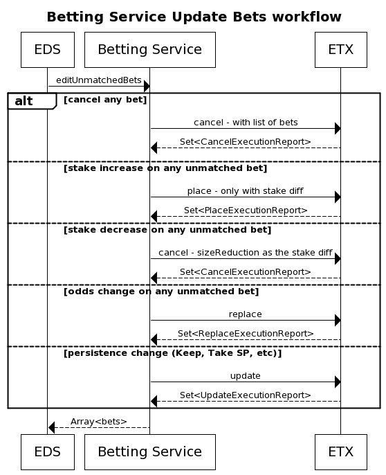

# ETX interactions for bet Editing

## Document Goals
* Development plan to create a set of functions that given a bet / market builds ETX orders to update accordingly based in the changed fields (to be reused across other channels)
* engage with architects and Michael Funnel to see if any changes possible on service side to improve front end (reduce complexity)

Technical Story: [US538956](https://ppb.tpondemand.com/entity/538956-spike-etx-interactions-for-bet-editing)

## Bet editing

On Betfair Exchange, when a bet is unmatched (fully or partially), the users have some options to edit them.

The list of operations that handles that changes are:
* **_place_**- Place new orders into a market - when a user edits his bet and increase his size, it will place a new bet with size value as size increment only (_new_size - original_size_)
* **_replace_**- This operation is logically a bulk cancel followed by a bulk place. The cancel is completed first then the new orders are placed.

  This method is being called when a user edit his bets that has impact on his exposure (when bet persistence type is **LIMIT** or **LIMIT_ON_CLOSE**), and this happens when user changes his price.

* **_cancel_**- Cancel all bets OR cancel all bets on a market OR fully or partially cancel particular orders on a market.

   Only LIMIT orders can be cancelled or partially cancelled once placed.

* **_update_**- Update non-exposure changing fields - persistence type


## Current implementation on channels

### EDS
On Exchange Desktop Site, the edit bet logic is being encapsulated on a module called [bf-betting-service](https://gitlab.app.betfair/exchange-components/bf-betting-service).

This module contains a method called `editBets`, and is responsible for updating open bets. It can increase/decrease stakes and odds, it can cancel bets and update bet persistence types (At In-Play status).


#### Edit bets workflow
First of all, it's assumed that EDS can edit several bets at once, making a single request to etx with a list of instructions - uses a json-rpc client. At the same time, it sends on request payload an array of method (place, edit, replace or cancel) and correspondent bets to edit parameters.

This implementation uses LBR (Live Bet Reporting) _searchOrders_ method to get bet state before edit any of them. All the bets from LBR are flagged as:
* **editable** if their execution status is `executable` or is `execution complete` and is a BSP bet (with `LIMIT ON CLOSE` persistence type and BSP liability greater than 0)
* **fullyMatched** if their execution status is `execution complete` and is not a BSP bet

For `editable` bets, it is checked what is the type of operation that we need to do to each bet, in order to get the correct instruction for each bet, and the split is done with following rules.
* Is a size change?
  * New size is greater than previous one?
    * Sets `place` instruction with `size` as size difference and `betId` (also price)
  * New size is lower than previous one?
    * Sets `remove` instruction with `sizeReduction` as size difference and `betId`
* Is a price change?
  * Sets `replace` instruction with `newPrice`and `betId`
* Is a persistence type change?
  * Sets `update` instruction with `newPersistenceType` and `betId`

  |
|:--:|
| *EDS Betting service update bets flow* |

### EMS

On Exchange Mobile Site, the edit bet logic is simpler than the Desktop one. On EMS only one action per edit is allowed, because it's done on inline betting mode, and it allows handling just one bet at each time.

The logic applied is (when is an edit):
*  Is a persistenceType change?
   * Calls `update`
* Is a price change?
  * Calls `replace`
* Changes size for a lower value?
  * Calls `cancel` with remaining size
* Changes size for a higher value?
  * Calls `place` with remaining size


## PURPOSED SOLUTION TO PLATFORMS
### Have a new method on backend side
Our first idea is to have a new method on the backend side which allows sending to the same endpoint every bet edit that is made on any bet. This allows to make every change on the same request, regardless the protocol used or the edit made, since it should accept an array of instructions.

In this purposed solution, applications will use a single method called `edit` to make any kind of bet editing. Instruction will send only the edited fields, and they will match what user did on the browser.

**Example:**
* A user have 5 bets and wants to edit all of them on the same edit action. He will do the following actions:
  * Change persistence type on the first bet
  * Increase size on the second bet
  * Decrease size on the third bet
  * Increase price on the fourth bet
  * Decrease price on the fifth bet

  |
|:--:|
| *Example of user editing several bets* |

With our proposal, the request sent to ETX will be something similar to this:
```JSON
POST /www/sports/exchange/transactional/v1.0/edit?alt=json HTTP/1.1
...
{
    "marketId": "1.162916729",
    "instructions": [
        {
            "betId": "1",
            "newPersistenceType": "PERSIST",
            "persistenceType": "LAPSE"
        },
        {
            "betId": "2",
            "newSize": "3",
            "size": "2"
        },
        {
            "betId": "3",
            "newSize": "2",
            "size": "4"
        },
        {
            "betId": "4",
            "newPrice": "320",
            "price": "310"
        },
        {
            "betId": "5",
            "newPrice": "300",
            "price": "310"
        }
    ],
    "customerRef": "1571049823730"
}
```

With current ETX implementation, for the same example, we need to divide this instructions in 4 types:
* the first one will be an `update` - is a persistence type change
```JSON
POST /www/sports/exchange/transactional/v1.0/update?alt=json HTTP/1.1
...
{
    "marketId": "1.162916729",
    "instructions": [
        {
            "betId": "1",
            "newPersistenceType": "PERSIST"
        }
    ],
    "customerRef": "1571049823730"
}
```
* the second one will be a `place` bet, with the remaining size calculated on the channel
```JSON
POST /www/sports/exchange/transactional/v1.0/place?alt=json HTTP/1.1
...
{
    "marketId": "1.162916729",
    "instructions": [
        {
            "selectionId": 19,
            "orderType": "LIMIT",
            "side": "BACK",
            "handicap": 0,
            "limitOrder": {
                "size": 1,
                "price": 310,
                "persistenceType": "LAPSE"
            }
        }
    ],
    "customerRef": "1571049823730"
}
```
* The third one will be a `cancel`, with calculation of size to cancel
```JSON
POST /www/sports/exchange/transactional/v1.0/cancel?alt=json HTTP/1.1
...
{
    "marketId": "1.162916729",
    "instructions": [
        {
          "betId": "3",
          "sizeReduction": 2
        }
    ],
    "customerRef": "1571049823730"
}
```
* The remaining bets will be `replace`
```JSON
POST /www/sports/exchange/transactional/v1.0/replace?alt=json HTTP/1.1
...
{
    "marketId": "1.162916729",
    "instructions": [
        {
          "betId": "4",
          "newPrice": 320
        },
        {
          "betId": "5",
          "newPrice": 300
        }
    ],
    "customerRef": "1571049823730"
}
```

This requires a lot of logic on the channels side, starting on split every bet by the corresponding method, and for `size` change, also needs to calculate the differential between the original size and the new size.

With purposed implementation on backend side, we will have the following benefits:
* Call the same endpoint for edit bets, regardless his kind of change
* Reduces complexity on frontend side
* Have the same behaviour on every channel - logic will be kept on the backend

Even with the benefits mentioned previously, this solution also brings new problems to the application:
* All ETX methods should be used in different scenarios, so channels will need to keep all the logic to fill current methods of ETX
* New response handling should be made
* Logic on front-end should be kept to prevent non-valid editions
* If previous point has some error, being every possible change under the same `edit` method, it will add new possible error states that doesn't exist currently
  * e.g.: edit request is sent with all the changes fields filled. This will be an invalid edit operation, and user will see the error only when ETX returns error for that operation


## Solution found for channels
### Have a new module to handle ETX method choose logic
In order to get a centralized solution for every Exchange Channel (EDS, EMS and TBD), this logic should be centralized under a common module. This will be a JS module, which allows us to use it both in front-end and also on aggregation loader.
In this way, we purpose to create a new node module that handles the logic of know which ETX method/instructions should be called to do the correct operation on bet edit.
On first interaction, this will be a new package within `tbd`, but in the future this module could be provided as part of the Exchange Bet Engine SDK.

This module will export a function called `edit`, and it will return an object with method name to call (`update`, `replace`, `cancel` or `place`), with the corresponding instruction object with all the required fields. However, we assume that this module should not do itself the call to ETX, because this should be handled by the application to use the desired protocol, because products can have different behaviors or requirements.

For example, EDS has a betslip and with that it is needed to edit several bets at once. This is allowed using JSON-RPC protocol, sending multiple operations on the same request. However, EMS handles only one transaction at the same time, since inline betting only allows to edit one bet each time. So it uses REST to call the service with the operation name on path. To be used by both products, the protocol and call should be done by the product itself, and not delegated to node modules.

Another part that can be easier with call on the static client is the response handling. Once that static client knows which method(s) have been called, it should also know which is the type of report that will be return by ETX, which should be easier to handle ETX response with correct instructions report type.

With this purposed implementation, we will have the following benefits:
* ETX be kept as it is today, so no new implementations of service or client should be made
* Application keeps the knowledge of what is being made - this will help on response reporting handling
* Since app will know the "rules", validations on front-end should be easier to implement to avoid incorrect requests
* Response report handling is the same as today
* This approach allows to start the implementation immediately, and is also easy to remove/adapt if the implementation of a new method on backend side is made

This solution also brings new problems to the application:
* Application must be aware what is the type change, to call the correct method

Our implementation will be a node module called `ETXService` that will export, on first iteration, an `edit` method, that will receive an array of pairs with edited and original bets as parameter, and return an array with the corresponding ETX instruction - `CancelInstruction`, `PlaceInstruction`, `ReplaceInstruction` or `UpdateInstruction`.

This module will be written in Typescript and will be compiled, in order to be used on EMS and EDS.


### Future work
To have a most powerful module on ETX edit handling, we also purpose to have also on this node module a response handler. This is really useful to create bet receipts in all products, since there are a lot of potential responses from ETX and sometimes we don't handle them correctly, which turns bad the user experience in some cases (EMS has a huge lack of ETX error handling).

