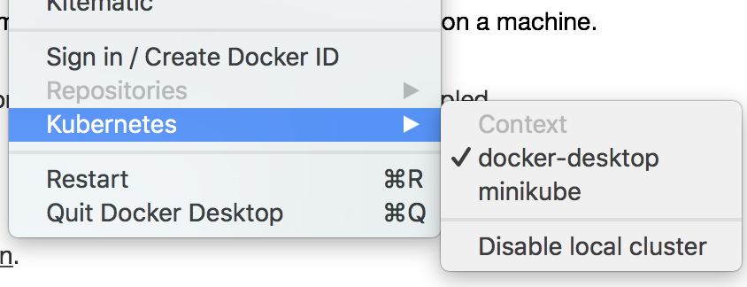
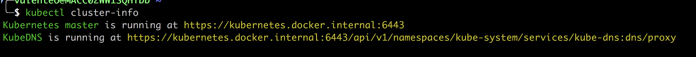
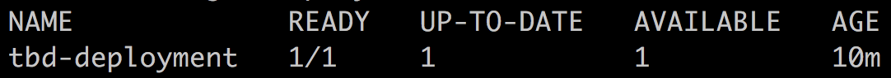
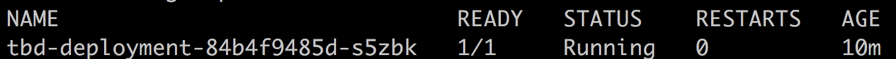
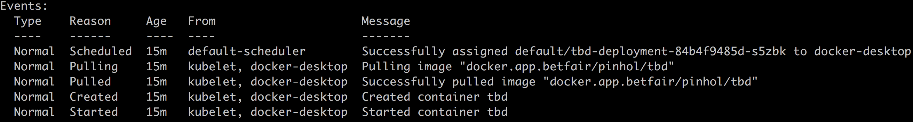
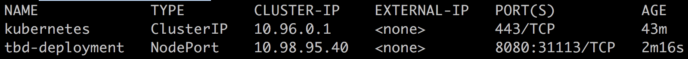
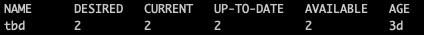
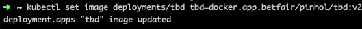
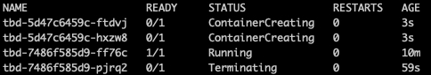

# Kubernetes (K8s) Spike

This spike's goal is to document all the necessary steps in order to create a local Kubernetes cluster, as well as how to deploy a Docker image on it and serving it.

## How to set up a local K8s cluster

1. Install Docker for desktop
2. Create/modify your _~/.docker/daemon.json_ with the following config:

    ```json
    {
      "debug": true,
      "experimental": false,
      "insecure-registries": [
        "artifactory-prd.prd.betfair:6666",
        "docker.app.betfair"
      ]
    }
    ```

3. Now **open a NEW terminal** login to our internal docker registry:

   1. `docker login docker.app.betfair`
   2. Use your CORP username (e.g.: pinhol) and your LDAP password

4. Enable Kubernetes on you **Docker for desktop** instance:
   

   1. Check that you should have a new kubernetes **context** docker-desktop selected
     

5. Open a new terminal window and input: `kubectl cluster-info`

   1. You should see the following output, which means that now you have Kubernetes cluster running on your local machine.
     

6. Now create a deployment with a Docker image that is already created and published

   1. `kubectl create deployment tbd-deployment —-image=docker.app.betfair/pinhol/tbd`

7. Verify that you have a **deployment** created

   1. `kubectl get deployment`
     

8. Also, verify that you have a pod associated with the deployment

   1. `kubectl get pods`
     

   2. You can also see the events of the pod creation through the human-readable output given by `kubectl describe pods`
     

9. Expose the app publicly so that you can access it from outside the cluster

   1. `kubectl expose deployment/tbd-deployment --type="NodePort" --port=8080`
   2. Note that you should prefix your deployment name with `deployment/`

10. Check that your service is displayed

    1. `kubectl get services`
      

11. You should now be able to access the app exposed in your cluster, through the mapped port (in this case 31113)
    1. `curl localhost:31113 -v`


## Scale up

1. Now you'll have 1 Pod with 1 service being exposed. In order to scale up to 2 replicas you should run the following command:
    1.  `kubectl scale deployments/tbd-deployment --replicas=2`
    2.  You should have now 2 replicas running. Check that with `kubectl get deployments`
    

## Update the application

1. Let's say you have a `v2` image of your application that you want to deploy.
   1. `kubectl set image deployments/tbd-deployment tbd=docker.app.betfair/pinhol/tbd:v2`
    

   2. Now verify that each pod is updating with `kubectl get pods`
   

   3. At the end, only the **new** Pods should be running (in this case the ones that were `ContainerCreating`)

## Rollback the application

1. To rollback an image to the previous version, you just need to:
   1. `kubectl rollout undo deployments/tbd-deployment`