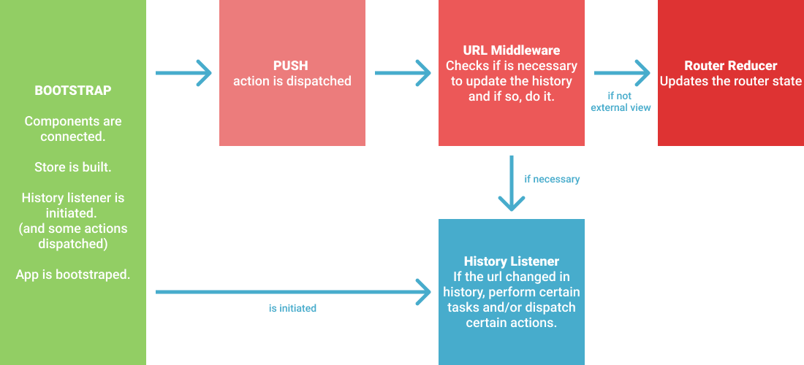

# Web - Navigation

## Document Goals

This document aims to document relevant information on the navigation, how some key components work and what should one mind when working in any navigation related feature.

### Considerations about this document at the time of creation

While developing the back button functionality if became pretty obvious that the navigation is becoming increasingly more complex over time and that some form of document to retain the knowledge on how it works is a necessity.
Since it is being writen from the perpective of "the back button", some information can be missing and some complex parts can be simplified.
Please remove this section when it becomes outdated/irrelevant.

## Page Navigation Flow and Key Components

When we navigate to the app in any route there are some important components to mind:

### History Listener

> `@ppb/tbd-store/src/middlewares/router/history-listener.ts`

The general behaviour of this one is obvious but what it does in detail is quite interesting:

It passed the [history](https://github.com/ReactTraining/history) library as the implementation of the history to use and it lets us manage the session history.

When instantiated it replaces the initial history path with the current one and the location state with the current `ViewLink`.
In the context of the back button is always sets it's state to `false` since it shouldn't be visible in the first impression.

It also dispatches the inicial state of the back button and the current location key.

Then, it will listen to evey url change and when that happens we can act on it, like dispatching actions with the new location key ou updating the back button state.

### URL Middleware

> `@ppb/tbd-store/src/middlewares/url-middleware.ts`
> Like any Redux middleware, it intercepts actions and acts (or not) on them. This one specificaly will intercept any `PUSH`, `FETCH_CATALOGUE_SUCCESS` and `EXTERNAL_PUSH` and may or may not update the history with them.
> In the context of page navigation, this middleware acts as a "gate keeper" and will decide if the history and global state should be updated.

> PUSH

Every time there is a navigation this is the action that will be dispatched. The `url-middleware` will check if the destination url and the previous one are different, and if true it will update the history via `push`.

Currently there are some other small considerations like if the `urn` type is `external view` (then the router state will not be updated but the window.location will) or `my account view` (router state will be updated but not the history).

Then the action will proceed.

> FETCH_CATALOGUE_SUCCESS

When the view changes (or when the app first loads) a `FETCH_CATALOGUE` action is triggered with the desired view `urn`. If it succeeds this middleware will intercept `FETCH_CATALOGUE_SUCCESS` and check if the returned view `urn` is the one we requested.

If this is true the action will proceed.
Likewise, if there is no current `urn` or `url` on the router state it indicates that the app just loaded.

Otherwise, if the `urn` is not the one we request, it means that this is a forced redirect (e.g.: trying to access a market that no longer exists, redirects you o the sport page of that market).
In this acenario the previous history internal state is invalid. As such we will update the history by replacing the previous internal state with the new one. But since only the `ViewLink` on the previous state is invalid, we will keep the previous back button state.

Then the action will proceed.

### Router Reducer

> `packages/tbd-store/state/router/router-reducer.ts`
> Like any reducer, this receives the relevant actions and updates the `Router` state acordingly.
