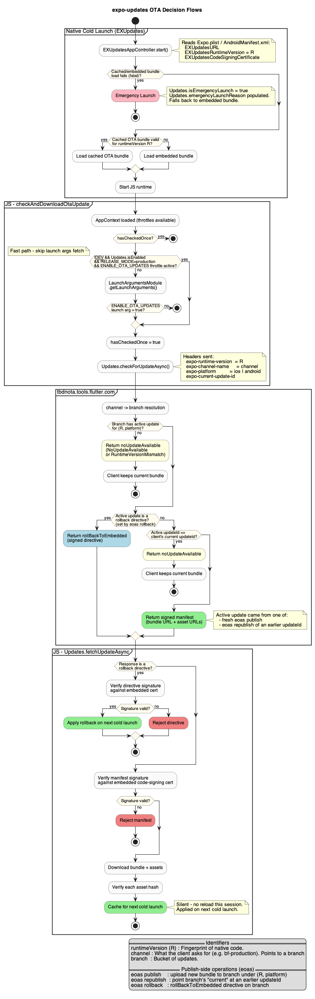
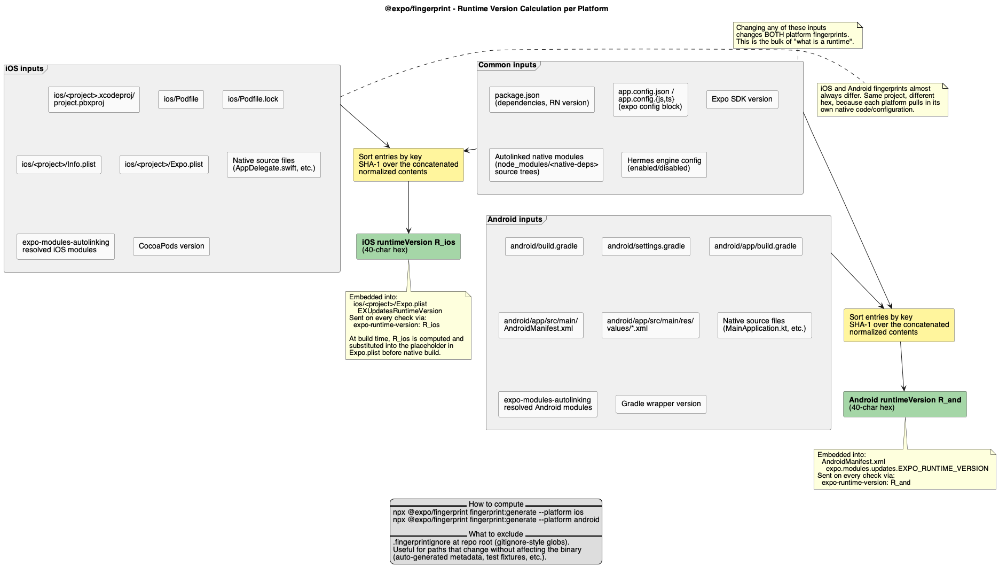

# OTA Updates - Implementation

JavaScript-only Over-The-Air (OTA) updates for the three native apps (Betfair / Paddy Power / SkyBet), shipping JS bundle hotfixes without going through AppStore / PlayStore review.

This document captures **what was built, decisions, and how to operate it**.

## Summary

- Built on top of [`expo-updates`](https://docs.expo.dev/versions/latest/sdk/updates/) (bare React Native workflow, no Expo prebuild) with [`expo-open-ota`](https://github.com/expo/expo-open-ota) (eoas) as the self-hosted update server.
- One **channel per brand**, mapped 1:1 to a **branch** of the same name on the eoas server.
- **Runtime version policy = fingerprint** (`@expo/fingerprint`). Native changes ship a new fingerprint and block OTA updates safely, forcing a binary release.
- **Manifests are code-signed**: clients verify against an embedded public certificate before applying any update or rollback.
- **Silent application strategy**: downloads happen in the background. New bundles activate on the next cold launch.
- Gated by throttle (`ENABLE_OTA_UPDATES`).

## Channel / Branch Mapping

The `expo-channel-name` baked into each app's `app.config.json` is what the device sends on every manifest check. The eoas server maps that channel to a branch of the same name (1:1).

| Brand       | App config                                                             | Channel          | Server branch    |
| ----------- | ---------------------------------------------------------------------- | ---------------- | ---------------- |
| Betfair     | [apps/bf/native/app.config.json](apps/bf/native/app.config.json#L76)   | `bf-production`  | `bf-production`  |
| Paddy Power | [apps/pp/native/app.config.json](apps/pp/native/app.config.json#L76)   | `pp-production`  | `pp-production`  |
| SkyBet      | [apps/sbg/native/app.config.json](apps/sbg/native/app.config.json#L80) | `sbg-production` | `sbg-production` |

A `<brand>-preview` branch can be served by changing the channel at native build time (binary rebuild required) or by overriding it at runtime via `Updates.setUpdateURLAndRequestHeadersOverride`.

## Key Decisions

| Decision               | Choice                                                                                                             |
| ---------------------- | ------------------------------------------------------------------------------------------------------------------ |
| Strategy               | Silent download, apply on next cold launch                                                                         |
| Throttle               | `ENABLE_OTA_UPDATES`                                                                                               |
| Update server          | Self-hosted `expo-open-ota` (eoas) in Docker                                                                       |
| Runtime version policy | `fingerprint` via `@expo/fingerprint`                                                                              |
| Manifest signing       | Enabled - PEM cert embedded natively, private key on the eoas server                                               |
| Native check trigger   | Manual JS-driven (`EXUpdatesCheckOnLaunch=NEVER`)                                                                  |
| JS invocation point    | Inside `app-context-middleware.native.ts`, after `next(action)` in the `NETWORK__FETCH_APP_CONTEXT_SUCCESS` branch |
| Telemetry              | OpenTelemetry spans via the existing Splunk RUM SDK                                                                |

## How It Works

**OTA decision flows** - cold launch path (Emergency Launch vs cached vs embedded), JS check, server response (`noUpdateAvailable` / `rollBackToEmbedded` / signed manifest), and client verification + caching.



Source: [ota-decision-flows.wsd](ota-decision-flows.wsd)

**Fingerprint calculation** - which files feed into `@expo/fingerprint` for each platform and where the resulting hash is embedded.



Source: [fingerprint-calculation.wsd](fingerprint-calculation.wsd)

In words:

1. **Cold launch (native)** - `EXUpdatesAppController.start()` reads `Expo.plist` / `AndroidManifest.xml`. If the cached OTA bundle is valid for the current runtime version, it loads. Otherwise the embedded bundle loads. Fatal errors during bundle load or JS thread crash trigger **Emergency Launch** with the embedded bundle

2. **JS check** - after AppContext returns, `checkAndDownloadOtaUpdate(throttles)` is invoked from [app-context-middleware.native.ts](packages/tbd-shared/helpers/app-context/app-context-middleware.native.ts). Exits immediately if already checked this session (`hasCheckedOnce`). If production conditions are all met (`!__DEV__`, `Updates.isEnabled`, `TBDN_RELEASE_MODE=production`) and the `ENABLE_OTA_UPDATES` throttle is active, proceeds directly without hitting native. Otherwise falls back to reading `ENABLE_OTA_UPDATES` from native launch arguments (`LaunchArgumentsModule.getLaunchArguments()`) — the launch arg path allows enabling OTA in test builds that don't satisfy the production conditions. Then calls `Updates.checkForUpdateAsync()`, which sends `expo-runtime-version`, `expo-channel-name`, `expo-platform`, and `expo-current-update-id` headers to the eoas server.

3. **Server response** - eoas resolves channel -> branch, finds the active update for that (runtimeVersion, platform), and returns one of:

   - `noUpdateAvailable` (with a reason: `NoUpdateAvailable`, `RuntimeVersionMismatch`, etc.)
   - `rollBackToEmbedded` directive (signed)
   - A signed manifest with bundle + asset URLs

4. **Client fetch & verify** - `Updates.fetchUpdateAsync()` verifies the manifest signature against the embedded code-signing cert, downloads assets, and verifies each asset's hash against the manifest. On success, the new bundle is cached for the next cold launch. No reload happens this session.

5. **Telemetry** - the whole flow is wrapped in an `ota.session` span ([ota-telemetry.native.ts](packages/tbd-shared/helpers/ota-updates/ota-telemetry.native.ts)) with child spans for the manifest check and the fetch, plus markers for outcome-specific reasons. Exported to Splunk RUM.

### Misc

- `apps/{brand}/native/android/gradle.properties` - bumped `MaxMetaspaceSize` from `512m` to `2g`. The additional `expo` / `expo-updates` / `expo-modules-core` Android library modules pushed lint past the previous Metaspace JVM cap and broke `lintVitalAnalyzeRelease` on the CI runners.

- `apps/{brand}/native/android/gradlew` - manually patched at the top of the wrapper script to `export EXPO_NO_METRO_WORKSPACE_ROOT=1` before any Gradle invocation. Required because `@expo/metro-config`'s rewrite of `node_modules` asset paths needs to be consistent between build-time (file destination under `drawable-*/`) and runtime. Without this env var, assets shipped get packaged into the APK but silently fail to load at runtime. Restore the export if at any time the wrapper is regenerated. This makes sure that there is no need to remember a magic environment variable

## eoas Interaction

eoas is expected to run in CI. The CLI is `npx eoas` (Node-based). The eoas Docker container in the cluster owns the storage credentials (S3/R2) and serves manifests to devices.

### Not fully self-hosted - dependency on expo.dev

"Self-hosted" applies to the **bundle storage and manifest serving** (eoas pod + S3). It does not apply to the publishing toolchain:

- **`EXPO_TOKEN`** is an **expo.dev account token** (created at https://expo.dev/accounts/org/settings/access-tokens). The eoas CLI uses it to authenticate against the Expo API for project identity, ownership checks, and account-level metadata - not against the eoas server itself. No expo.dev token = no publish.
- **`expo export`** (run internally by `eoas publish`) pulls JS bundling defaults from `@expo/*` packages that bake in some assumptions about the Expo platform. The toolchain is Expo-based.

Practical implications:

- An expo.dev organization + project (one per brand) is required.
- Rotating / revoking the `EXPO_TOKEN` breaks publishing immediately but bundle delivery to devices keeps working (that path is purely eoas + storage).
- If expo.dev has an outage on the API surface the CLI calls, publishing can fail even though the OTA serving side is healthy. Devices keep getting the last-published bundle.
- Auditing: the published-by identity is whatever expo.dev resolves the token to. Use a service account / machine token in CI, not a personal one.

### CLI env vars

Common env vars used by the CLI:

- `EXPO_TOKEN` - **expo.dev account token** (see above). Treated as a secret.
- `NODE_ENV=production`
- `APP_BRAND=<Betfair|Paddy Power|SkyBet>` - selects the per-brand config.
- `EXPO_NO_METRO_WORKSPACE_ROOT=1` (mandatory) - keeps Metro's server root on the app, not the monorepo workspace root, while the CLI bundles JS.

### Publish a new bundle

```bash
EXPO_TOKEN=<redacted> \
NODE_ENV=production \
APP_BRAND=Betfair \
EXPO_NO_METRO_WORKSPACE_ROOT=1 \
  npx eoas publish \
    --channel=bf-production \
    --branch=bf-production \
    --platform=android \
    --message="<release notes>"
```

Builds the bundle (`expo export`), creates `expoConfig.json`, requests presigned upload URLs from the eoas server, uploads bundle + assets, then commits the upload. The new manifest becomes the active update for the given (branch, platform, runtimeVersion).

Repeat with `--platform=ios` for iOS.

### Republish an existing bundle (roll-forward an older bundle)

```bash
EXPO_TOKEN=<redacted> \
NODE_ENV=production \
APP_BRAND=Betfair \
EXPO_NO_METRO_WORKSPACE_ROOT=1 \
  npx eoas republish \
    --branch=bf-production \
    --platform=android
```

Points the branch's "current" pointer at a previously-published `updateId`. No new bytes are uploaded - the server rewrites the branch state so that subsequent `checkForUpdateAsync` calls return the chosen prior manifest. This is the typical "roll forward to an older bundle" lever.

### Rollback to embedded

```bash
EXPO_TOKEN=<redacted> \
RELEASE_CHANNEL=bf-production \
NODE_ENV=production \
APP_BRAND=Betfair \
EXPO_NO_METRO_WORKSPACE_ROOT=1 \
  npx eoas rollback \
    --branch=bf-test
```

Emits a signed `rollBackToEmbedded` directive on the branch. Clients on that branch receive it on next check. After signature verification, they apply the rollback on the next cold launch (cached OTA bundle is discarded, the binary's embedded bundle is loaded). Use when no OTA bundle is acceptable and you need users to drop back to the AppStore binary.

### Compute a fingerprint locally

```bash
npx @expo/fingerprint fingerprint:generate --platform=android
# or
npx @expo/fingerprint fingerprint:generate --platform=ios
```

Outputs a 40-character hex hash representing the current native shape of the app for that platform. Useful when verifying CI placeholder rewrites or sanity-checking that a native change actually produces a new fingerprint.

## URLs

- **Runtime URL (devices read this)** - `https://tbdnota.tools.flutter.com/manifest`
  Embedded in `Expo.plist` (`EXUpdatesURL`) / `AndroidManifest.xml` (`EXPO_UPDATE_URL`) and in `app.config.json` (`OTA_UPDATES_URL`). Public, behind Cloudflare, read-only at the edge.

- **Publish URL (CLI writes here)** - It retrieves from app.config.json.

## Operational Notes

- **Publish per platform** - the eoas branch state is platform-specific. A single `publish` call covers one platform or all.
- **Rollback != republish** - `rollback` returns users to the embedded bundle (binary's baseline). `republish` keeps them on OTA but on an older bundle. Republish is the safer everyday lever. Rollback is for "everything OTA is bad, fall back to what we shipped via the store."
- **Fingerprint discipline** - if a native change merges, the fingerprint changes for that platform. Until the binary with the new fingerprint reaches users (via store update), OTA is blocked for those users by design - the server returns `noUpdateAvailable` with `RuntimeVersionMismatch` reason.
- **Throttle as kill switch** - turning off `ENABLE_OTA_UPDATES` in AppContext immediately stops new OTA checks across the fleet on the next AppContext fetch. Useful for incident response.

## References

- `expo-updates` SDK reference: https://docs.expo.dev/versions/latest/sdk/updates/
- Bare workflow integration: https://docs.expo.dev/bare/installing-updates/
- `@expo/fingerprint`: https://github.com/expo/expo/tree/main/packages/%40expo/fingerprint
- `expo-open-ota` (eoas): https://github.com/expo/expo-open-ota
- Expo Update Protocol v1: https://docs.expo.dev/technical-specs/expo-updates-1/
