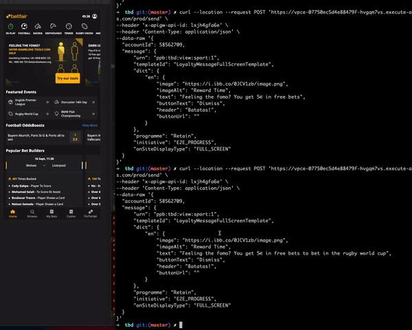
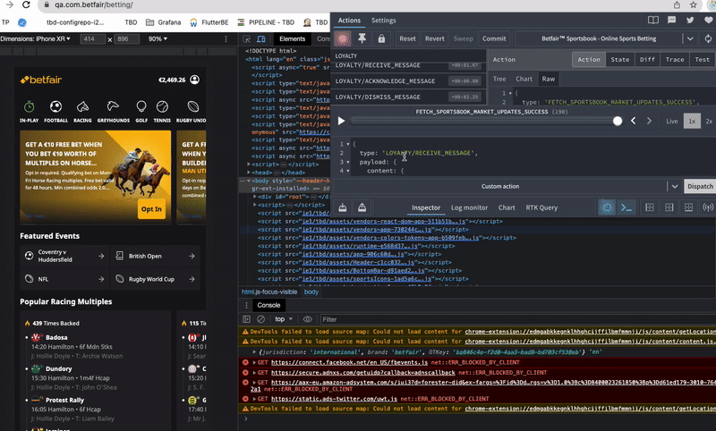

# Rewards Message Dialog

The Loyalty Messages project uses an integration with OSG through the usage of the lib OSG Client, which then connects to the service through a WebSocket.
Here is a curl that, when updated with:

- account id and,
- correct environment HTTP API ID

a dialog with the reward message is shown to the user.

Replace the `HTTP_API_ID` and `ACCOUNT_ID` with data you need.

```bash
curl --location -v --request POST 'https://vpce-07750ec5d4e88479f-hvgqm7vs.execute-api.eu-west-1.vpce.amazonaws.com/prod/send' \
--header 'x-apigw-api-id: `HTTP_API_ID`' \
--header 'Content-Type: application/json' \
--data-raw '{
    "accountId": `ACCOUNT_ID`,
    "message": {
        "urn": "ppb:tbd:view:sport:1",
        "templateId": "LoyaltyMessageFullScreenTemplate",
        "dict": {
            "en": {
                "image": "https://i.ibb.co/0JCV1zb/image.png",
                "imageAlt": "potato",
                "text": "Orange!",
                "buttonText": "Check active bonuses",
                "header": "Congratulations!",
                "buttonUrl": "betting/football/english-premier-league/aston-villa-v-liverpool/e-31421972"
            }
        },
        "programme": "Retain",
        "initiative": "E2E_PROGRESS",
        "onSiteDisplayType": "FULL_SCREEN"
    }
}'

```

## Visual representation



More information on HTTP API ID can be found [here](https://flutteruki.atlassian.net/wiki/spaces/PST/pages/225318273/OSG+-+On-Site+Gateway). Plase note that QA environment is for test only and does not have pairity with bf rebuild QA environment.
The environments tested (qa, nxt and prd), only nxt and prd work seem to have parity.

## Tip

Tip: For client side tests only, we can dispatch an action with the redux devtools. e.g.

```bash
{
  type: 'LOYALTY/RECEIVE_MESSAGE',
  payload: {
    content: {
      topic: 'relevantMessaging',
      message: {
        urn: 'ppb:tbd:view:sport:1',
        templateId: 'LoyaltyMessageFullScreenTemplate',
        displayType: 'FULL_SCREEN',
        params: null,
        template: {
          image: 'https://i.ibb.co/0JCV1zb/image.png',
          imageAlt: 'potato',
          text: 'Orange!',
          buttonText: 'Check active bonuses',
          header: 'Congratulations!',
          buttonUrl: 'betting/football/english-premier-league/aston-villa-v-liverpool/e-31421972'
        }
      },
      messageType: 'TOPIC_MESSAGE',
      subscriptionId: 'UewQCshpo5Uf7MYQqGR90',
      correlationId: '557b596c-b619-49b5-a37d-00d1571c26dc',
      key: 'E2E_PROGRESS',
      publishTime: '2023-09-22T16:23:20.997347Z',
      ackRequired: true
    },
    acknowledged: false,
    isDisplayed: true
  }
}
```

### Visual representation



## Logs

Websockets messages can be inspected through Grafana. We can find those logs [here](https://grafana.dev.betfair/d/lYQ8-oQGk/aws-cloudwatch-logs?orgId=1) for nxt and [here](https://grafana.app.betfair/d/lYQ8-oQGk/aws-cloudwatch-logs?orgId=1) for prd. In order to filter the sources for the log:

1. in the Log Group input search gor `nxtbf-osg` (in case you are in the prd grafana, `prdbf-osg`)
2. you can see different 6 groups (subscription, connection, disconnection, etc...) where you can search for you account id.

Looking at the logs can be helpful for debugging and to be sure you are hitting the service.

## More information

- [On-Site Gateway Confluence page](https://flutteruki.atlassian.net/wiki/spaces/PST/pages/225318273/OSG+-+On-Site+Gateway)
- [Loyalty Messaging](https://flutteruki.atlassian.net/wiki/spaces/BSBG/pages/145442544/Loyalty+Messaging)
- For questions, please reach out to [#ask_personalization](https://betfair.slack.com/archives/CKXCLMAU9) slack channel.
- Grafana nxt https://grafana.dev.betfair/d/lYQ8-oQGk/aws-cloudwatch-logs?orgId=1
- Grafana prd https://grafana.app.betfair/d/lYQ8-oQGk/aws-cloudwatch-logs?orgId=1
