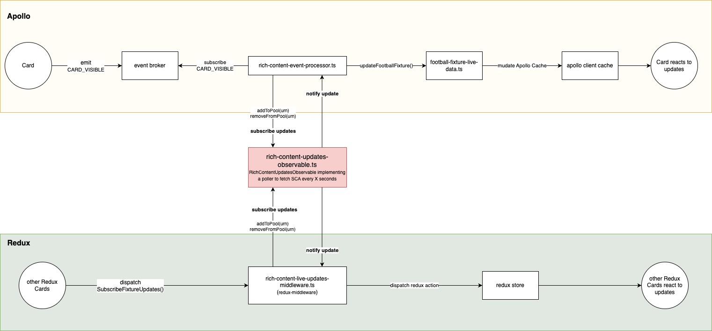

### **Rich Content Live Updates**

---

#### **Overview**

The Sports catalogue fetched from SCAN is enriched with real-world event data retrieved from SCA API. This enrichment provides users with useful information about the event, like historical data about the opponent teams/players and in-play stats like scores, game time and other incidents.

Given the nature of this information, this data is likely to change often over time, especially for events in play. For this reason, the app seeks to fetch the latest statuses of the game every time possible, and this is done through a polling mechanism implemented by the [rich-content-poller](https://github.com/Flutter-Global/tbd/blob/master/packages/tbd-store/middlewares/rich-content-updates-observable.ts).

This poller (from now on referred to as "`RichContentUpdatesObservable`") implements the Observer pattern and is designed to fetch updates from SCA remote API at regular intervals (5 seconds for in-play and 30 seconds for pre-play - subject to configuration) to which the Observers can subscribe to, and receive real-time updates.  
Since `RichContentUpdatesObservable` has no knowledge about the current state of the app, nor its UI, it is the Observer's responsibility to indicate which Events they are interested in receiving updates about so the poller can fetch only those that become valuable for the user to receive updates about. Once these updates are fetched, these are notified to the Observers for further processing.

#### **Architecture**

- **`rich-content-updates-observable.ts`**: The central component that initiates network requests at regular intervals. Implements the Observer pattern, enabling external entities (Observers) to subscribe to updates.
- **`rich-content-event-processor.ts`** and **`rich-content-live-updates-middleware.ts`**: Observers that subscribe to the `RichContentUpdatesObservable` to receive updates whenever the poller hits the SCA API for stats.



`rich-content-updates-observable.ts` focuses only on abstracting the logic of fetching updates from the SCA API and therefore, it has no knowledge about any external State or UI. For this reason, it is up to the Observers to:

1. indicate which Fixtures or Races to pull from SCA. For that, Observers must make use of the `.addEvent(Event)` and `.removeEvent(Event)` methods to feed the pool of Events to be retrieved from SCA.
2. perform any further processing required for the updates to be reflected in the UI. And for this, we have:  
   2.1. `rich-content-live-updates-middleware.ts`, responsible for implementing the interface between this polling mechanism and the Redux Store. Any update in the poller will translate in a Redux Action that will feed the Redux Store with the corresponsing changes to State, which then reflect in the UI updating accordingly.  
   2.2. `rich-content-event-processor.ts`, responsible from implementing the interface between the polling mechanism and the Apollo Client Cache. Mutations are performed against the Apollo Client Cache through the `.modify()` method, updating the State and then reflecting in the UI updating accordingly.

#### **Usage Code Example**

Here’s a simplified code example to illustrate the usage of `RichContentUpdatesObservable`.

```typescript
// 1. get instance of the observable to subscribe to
const richContentUpdatesObservable = RichContentUpdatesObservable.getInstance();

// 2. register subscriber to receive updates at every polling cycle.
richContentUpdatesObservable.subscribe((response: RichContentUpdateCallbackPayload) => {
  if (response.updates?.fixtures.football) {
    console.log(response.updates?.fixtures);
    console.log(response.updates?.races);
  }
});

// 3. let the poller know which Events to retrieve updates about.
// ex. when a particular card that displays Stats for a given Football Event is displayed in the screen, tell the poller that the app
// is now  interested on getting updates about that particular FootballFixture.
subscribeEvent("@@UI/STATS_FORM_CARD_LOADED", (payload) => {
  richContentUpdatesObservable.addEvent({
    urn: payload.urn,
    typename: "FootballFixture",
  });
});
```
