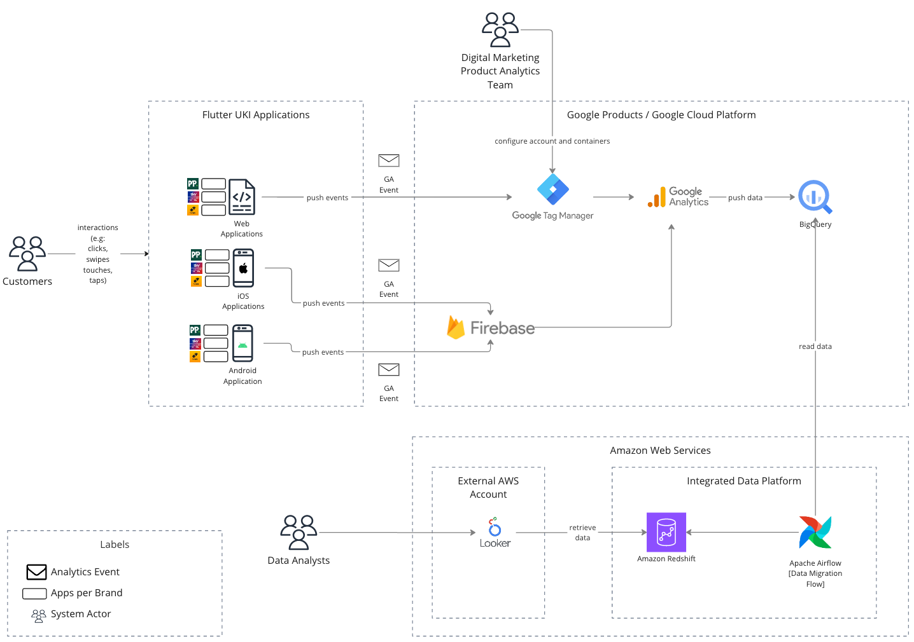
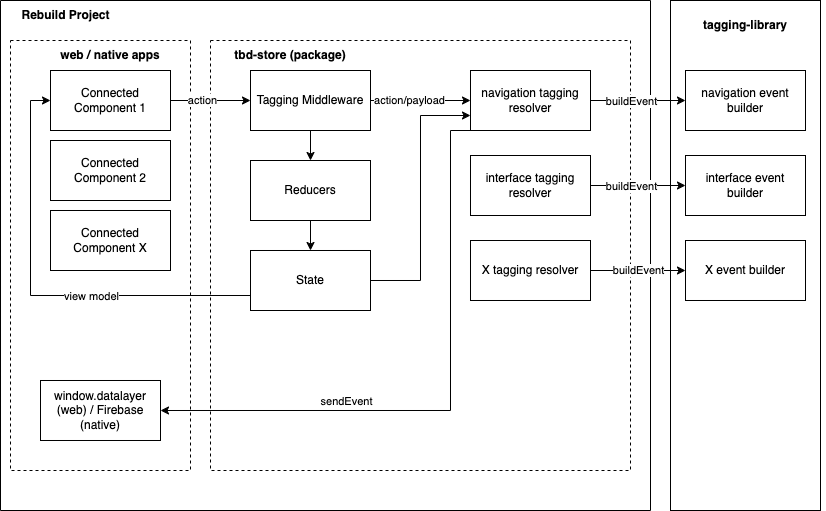

# Tagging (GA4)

Google Analytics 4 is an analytics service that enables you to measure traffic and engagement across your websites and apps.

## High Level Overview of Tagging flow



## Tracking Tools

### Google Analytics

Google Analytics is a web analytics service made by Google that provides website and app owners with a wealth of information about user activity. It allows monitoring of user engagement and conversion rates allowing businesses to measure the effectiveness of their online products.

### Google Tag Manager

Google Tag Manager is a tag management solution by Google that simplifies the process of deploying and managing tracking codes and tags on websites and mobile apps.

It provides marketeers and website administrators with a centralized platform to add, edit, and publish tag in a simplified way.

### Firebase

Firebase is a mobile and web application platform developed by Google and used for a wide set of use cases.

In the context of tagging, Firebase is used as the entrypoint to Google Analytics, for mobile applications.

## GA4 Initialization

GA4 initialization is different from web to native applications.

### Web Application

On web applications GA is executed through Google Tag Manager, by including GTM into the web app, it then includes the GA4 script and we can start collecting events through the data layer.

### Native Applications

For iOS and Android applications, we use Firebase as the tool to make the interface between Flutter UKI applications and Google Analytics.

## Supported Events

During the move from Universal Analytics (UA) to Google Analytics (GA4), it was created a list of events that can/should be used by each brand, in order to unify the tagging and analytics across UKI brands

The full list of events can he found [here](https://docs.google.com/spreadsheets/d/1J5E5VZF-IqUvIgpxcz1ZAxrlY1qNrOC4w3puDof-6eE/edit#gid=94323729).

## How is tagging implemented?



## How to add a new tagging event?

1. Add your action to the [tagging middleware](../../packages/tbd-store/middlewares/tagging.ts). If possible reuse the a generic action and a generic `tagging resolver`.

```js
const ACTION_TAGGING_MAPPER: ActionTaggingMapper = {
  ...
  [UI__NAVIGATE_TO_X]: getNavigationEvent as TaggingBuilder,
  [UI__MY_BETS_EXC_ORDER_STATUS_SWITCH]: getMyBetsExchangeOrderStatusClickEvent as TaggingBuilder,
  ...
};
```

2. [OPTIONAL - Only if not possible to reuse a generic action and tagging resolver], you need to create a new tagging resolver, that should use a `event builder` from `tagging-library`.
   For instance, [navigation resolver](../../packages/tbd-store/middlewares/tagging.ts)

```js
export const getCompetitionLinkClickEvent = (
  action: NavigateToCompetitionView,
  state: ApplicationState,
): NavigationEvent => {
  const { cardUrn, cardType, href, text } = action.payload;
  const viewType = getViewTypeSelector(state);

  const metadata = getLayoutMetadata(state.layouts, {
    urn: cardUrn,
  });

  const { groupTitle, tabTitle } = getCardParentTitlesByURN(state.layouts, cardUrn);

  return buildNavigationEvent({
    elementText: text,
    action: TaggingAction.NAVIGATED_TO,
    type: TaggingAction.NAVIGATED_TO,
    module: `${viewType} - ${cardType} - ${groupTitle} - ${text} - ${tabTitle}`,
    destinationUrl: href,
    position: metadata.verticalPosition?.toString(),
    moduleDisplayOrder: metadata.horizontalPosition?.toString() || "",
  });
};
```

## FAQ

### What is the Tagging Library?

As part of the target state for the Flutter UKI tagging architecture, each application has to map their own user actions to Google Analytics events.

In order to keep consistency between the Tracking Plan (specification) and the implementation, a Flutter UKI Tagging Library was created to assist on the process.

More info about the library and how to use it can be found [here](https://github.com/Flutter-Global/tagging-library).

### Where can I find the Flutter UKI Tracking plan spreadsheet?

Tracking Plan is available [here](https://docs.google.com/spreadsheets/d/1J5E5VZF-IqUvIgpxcz1ZAxrlY1qNrOC4w3puDof-6eE/edit#gid=94323729)

### How to debug and event?

Detailed process [here](https://support.google.com/analytics/answer/7201382?hl=en#zippy=%2Cgoogle-tag-manager)

### How can I access GTM console? ?

In order to access the GTM console, you need a Flutter Google Account.

For this, you have two options:

Create a new google account by choosing an existing Flutter Email: https://accounts.google.com/signupwithoutgmail?hl=en

Use Flutter email as an alternate email to an existent gmail (Google Account) Sign in to your Google Account with another email address - Computer - Google Account Help

After these steps, you need your email to be added in the Google account. That is managed by Jellyfish but you can raise your requests with @Craig Gardner.

### How can I use GTM Preview Mode?

In order to access GTM Preview mode you can follow the steps in the following page: [GTM preview](https://flutteruki.atlassian.net/wiki/spaces/ACQ/pages/362250474/GA4+TAG+Manager+debug+mode)

## Useful Links

- [Tagging Library](https://github.com/Flutter-Global/tagging-libraryConnect)
- [GA4 limits](https://support.google.com/analytics/answer/11202874?hl=en)
- [GA4 events](https://developers.google.com/analytics/devguides/collection/ga4/ecommerce?client_type=gtag#add_or_remove_an_item_from_a_shopping_cart)
